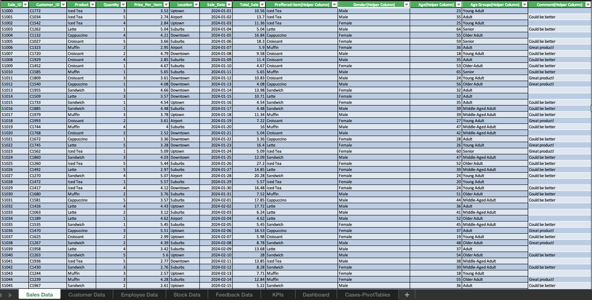
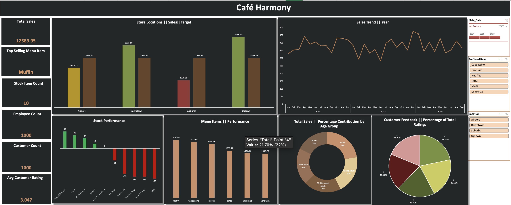

#
  

    
  

  
# ☕ Café Harmony Business Performance

Café Harmony has seen impressive growth but now faces new challenges as the company is scaling to meet customer
demand. This project provides a comprehensive analysis of Café Harmony’s business operations using a multi-sheet dataset. Built in Microsoft Excel, the interactive dashboard tracks key performance indicators across sales, customer feedback, inventory, and employee data, helping the company's management make key decisions for growth.

---

## 🎯 Project Objective

To help Café Harmony make data-driven decisions by answering the business questions and presenting findings in a clear, visually appealing dashboard.

---

## ❓ Business Questions

-  Which menu items are performing the best across different locations?
-  What is the customer profile that tends to spend the most (age, gender, or preferred product)?
-  How can the café improve its stock management to avoid running out of popular items while also
reducing overstock?
-  Are there any locations or employee performance issues that require attention?

---

## 🧾 Dataset Overview

The workbook consists of the following sheets:

- **Sales Data** – Transaction details including date, menu items, quantity, and revenue  
- **Customer Data** – Demographics such as age group, gender, and location  
- **Employee Data** – Staff information by department and branch  
- **Stock Data** – Inventory records with stock levels and thresholds  
- **Customer Feedback Data** – Ratings and satisfaction scores
  

    
  

---

## 📊 Dashboard Features
  

    
  

### ✅ KPI Summary Cards
- **Total Sales**
- **Top-Selling Menu Item**
- **Stock Item Count**
- **Employee Count**
- **Customer Count**
- **Average Customer Rating**

---

### 📈 Key Visual Insights

- **📍 Store Location Performance**  
  Visual comparison of sales across store locations with reference to sales targets

- **📦 Stock Analysis**  
  Categorized into **Understock**, **Overstock**, and **Optimum** to support inventory decisions

- **📈 Sales Trend Over 3 Years**  
  A time-series view of sales progression to highlight growth and seasonality

- **🍽️ Menu Item Sales**  
  Chart of menu item performance by total sales

- **👥 Sales by Age Group**  
  Total sales and percentage contributions by customer age categories

- **🌟 Customer Rating Analysis**  
  Ratings breakdown with percentage distribution to track customer satisfaction

---

## 🛠 Tools Used

- **Microsoft Excel**
  - Pivot Tables
  - Chart Visualizations
  - Slicers
  - Timeline
  - Conditional Formatting
  - Formulas (SUMIFS, AVERAGE, IFs, XLOOKUP etc.)

---

## 💡 Insights & Recommendations

- There should also be marketing campaigns to target best-selling items and its menu should be tailored to promote the top items for each location.
- Café Harmony should focus its promotions like discounts on adults as they spend the most. As seniors are the least likely to spend money, the café should ensure seating/environment is comfortable, adjusted menu to suit dietary needs, and tech support.
- To improve its stock management, Café Harmony should restock based on sales/location demands. Stock levels should be monitored.
- To ensure that employees & branches are meeting targets, the café should monitor low performances, provide additional training, allocate resources, and rewards to boost morale

---

📌 *This project demonstrates how Excel can be used as a complete analytics tool to uncover business insights, track performance, and support operational decisions.*
