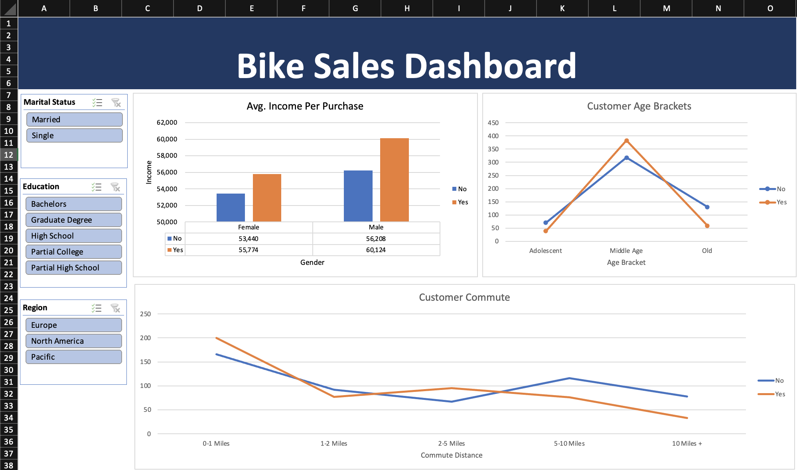

# 🚴🏽Bike Sales Analysis (Excel)

This project explores customer demographics and purchasing behavior using Excel. I analyzed a bike sales dataset and developed an interactive dashboard to surface insights related to income, age, gender, commute distance, and purchase trends.

---

## 📊 Project Objective

To identify key patterns in customer data that influence bike purchases, and present these insights through a clean, interactive Excel dashboard that supports data-driven decision-making.

---

## 🧩 Key Insights Visualized

- **Average Income by Gender & Purchase Decision**  
  Customers who purchased bikes generally had higher income across both genders, especially male buyers.

- **Age Bracket Trends**  
  The majority of bike purchases came from customers in the *Middle Age* bracket, with fewer purchases among adolescents and older customers.

- **Commute Distance & Bike Purchase**  
  Shorter commute distances (especially 0–1 miles) showed higher bike purchase rates compared to longer commutes.

---

## 📎 Dashboard Features

- **Slicers for Filtering** by:
  - Marital Status  
  - Education  
  - Region

- **Interactive Charts**:
  - Bar chart: Avg. income per purchase (by gender)  
  - Line chart: Bike purchases by age bracket  
  - Line chart: Commute distance vs. purchase decision
  
  
---

## 🛠 Tools Used

- **Microsoft Excel**  
  - Pivot Tables  
  - Slicers  
  - Charts  
  - Conditional Formatting

---

## 📁 Files Included

- `BikeSalesDashboard.xlsx` – the Excel file with interactive dashboard  
- `NYCitiBikeDashboard.png` – dashboard screenshot preview  
- `BikeSalesDataset.csv` *(optional if you upload the data separately)*

---

## 💡 Takeaway

This project demonstrates how Excel can be used not just for analysis, but for clean and effective data storytelling — highlighting how demographic and behavioral factors influence consumer decisions.

---

📸 *Explore the dashboard or try applying different slicers to generate your own insights!*
