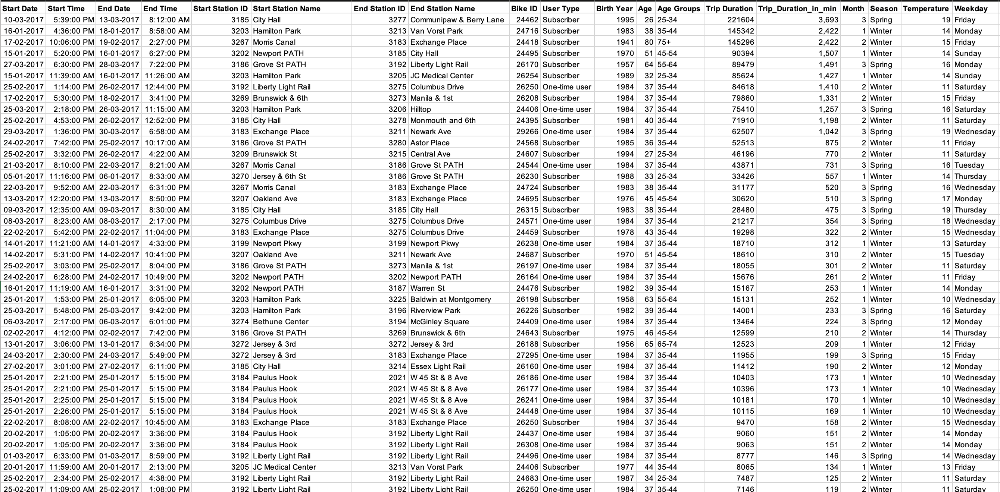
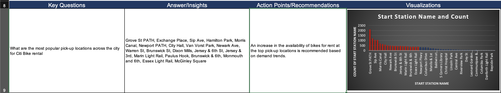

    

  

# 👪🏾 Customer Behavior Analysis

This project explores the Citi Bike trip dataset to better understand how different types of customers such as **subscribers** and **one-time users**  interact with the service. The aim is to uncover patterns in bike usage that can support operational and marketing decisions.
  

  

    
---

## 🎯 Project Objective 

To analyze Citi Bike customer behavior in order to:

- **Identify high-demand areas** where more bikes or stations should be installed
- **Understand customer segments** and usage patterns
- **Support targeted marketing strategies** based on ride trends, user types, and location behavior

---

## 🔍 Key Questions Explored

- What are the most popular pick-up locations across the city for Citi Bike rental?
- How does the average trip duration vary across different age groups?
- Which age group rents the most bikes?
- How does bike rental vary across the two user groups (one-time users vs long-term subscribers) on different days of the week?
- Does the user age impact the average bike trip duration?

---

## 📊 Tools Used

- **Microsoft Excel**  
  For data cleaning, pivot table analysis, and dashboard creation

---

## 📁 Files Included

- `NewYorkCitiBikes.xlsx` – Excel file with raw & cleaned data, pivot tables, insights and recommendations
  [Web View](https://1drv.ms/x/c/2d0f9638f277c6b4/EfwP7HUSckZKtIyqng0SYOgB2HIiRTL5uKJPpn23itxMjA)

---

## 💡 Outcomes

This analysis provides data-driven recommendations for:

- **Optimizing bike station placement**
- **Enhancing the customer experience**
- **Creating targeted marketing for different rider profiles**
    ### 🚴🏾 Rider Behavior at a Glance
     One  of the charts generated from the dataset include popular pickup locations.
  - **Action point/Recommendation:** An increase in the availability of bikes for rent at the top pick-up spots based on demand trends.

    

  

---

📍 *This project demonstrates how data can be used to support smart city planning and improve shared mobility systems.*

