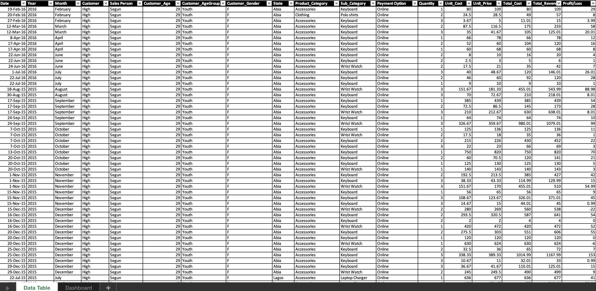
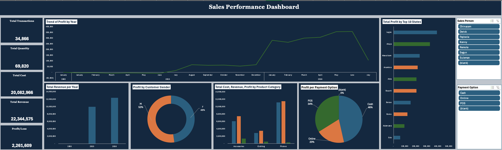

# Sales Performance Analysis 

This project presents an in-depth analysis of sales data to track performance, customer behavior, and product profitability. The dashboard was built using Microsoft Excel and provides a clear, interactive view of key business metrics across multiple dimensions.
  
---

## 🎯 Project Objective

To create a comprehensive Excel dashboard that helps monitor overall sales performance, highlight profit trends, and uncover opportunities by customer, product, and region.

---
## Dataset Overview

The dataset includes transactional and customer-level information with the following key fields:

- **Date, Year, Month**
- **Customer Measure (High / Low)**
- **Salesperson**
- **Customer Gender, Age**
- **Location: State**
- **Product Category & Sub-Category**
- **Payment Option**
- **Quantity, Unit Cost, Total Cost, Total Revenue, Profit/Loss, etc**
  

  

---

## 📊 Key Dashboard Features

### 🗂️KPI Cards - Metrics 
- **Total Transactions**
- **Total Quantity Sold**
- **Total Cost**
- **Total Revenue**
- **Profit**
- **Loss**

### 📈 Visual Insights
- **Profit Trend by Year**
- **Total Revenue by Year**
- **Profit by Customer Gender**
- **Cost, Revenue, and Profit by Product Category**
- **Profit by Payment Option**
- **Top 10 States by Total Profit**

### 🎛️ Interactive Elements
- **Salesperson Slicer** – filter views by individual salesperson
- **Payment Option Slicer** – analyze performance by payment method

---

## 🛠 Tools Used

- **Microsoft Excel**
  - Pivot Tables
  - Slicers
  - Conditional Formatting
  - Chart Visualizations
  - Calculated Fields (for Profit/Loss)

---

## 📁 Files Included

- `SalesPerformance.xlsx` – Interactive dashboard file  
- `SalesData.png` – Preview of the dataset 
- `SalesDB.png` – Preview of the dashboard layout
  
---

## 💡 Insights & Outcomes

- Identified most profitable product categories and states
- Tracked yearly profit trends to evaluate business growth
- Highlighted gender-based differences in purchasing behavior
- Assessed the impact of payment options on total profit
  

  

---

📊 *This project demonstrates how Excel can be used to turn raw sales data into actionable business insights using clean design and interactive visual tools.*
