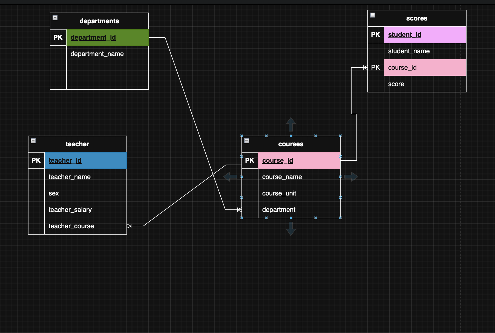
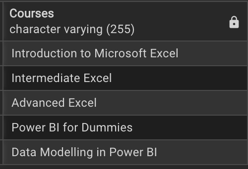

# 🎓 Academic Performance Analysis — PostgreSQL 

This project analyzes academic data stored in a PostgreSQL database, covering **departments**, **courses**, **teachers**, and **student scores**.  
It demonstrates practical skills in database design, SQL querying, and data insights generation.

---

## 🗃️ **Project Structure**

| Table       | Description                                      |
|-------------|--------------------------------------------------|
| `departments` | List of departments                            |
| `courses`     | Courses offered, linked to departments & scores |
| `teacher`     | Teacher details                                 |
| `scores`      | Student scores per course                      |

---

## 🔗 **Entity-Relationship Diagram (ERD)**

**Entities & relationships:**
- A **department** can offer many **courses**
- A **teacher** can teach many **courses**
- A **course** can have many **scores** (one per student)
- Each **score** ties a student to a course
  
<p align="center">
  
</p>


---

## 🗝️ **Key Queries & Insights**

### 📌 1. Courses offered per department
```sql
	SELECT course_name AS "Courses"
	FROM courses;
```
<p align="left">
  
</p>
Looks like this department is for Data Analytics, awesome!

---

### 📌 2. The departments in the school
```sql
	SELECT department_id, department_name
	FROM departments;
```
<p align="left">
  
</p>
Looks like this department is for Data Analytics, awesome!


