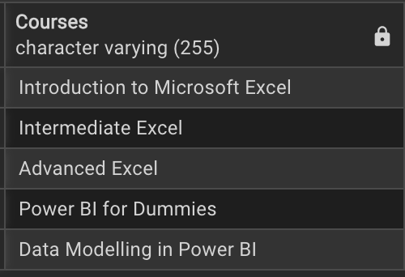
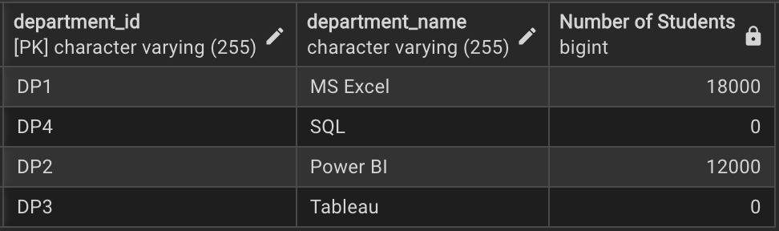

# 🎓 Academic Performance Analysis — PostgreSQL 
[](https://www.postgresql.org/)

This project analyzes academic data stored in a PostgreSQL database, covering **departments**, **courses**, **teachers**, and **student scores**.  
It demonstrates practical skills in database design, SQL querying, and data insights generation.

---

## 🗃️ **Project Structure**

| Table       | Description                                      |
|-------------|--------------------------------------------------|
| `departments` | List of departments                            |
| `courses`     | Courses offered, linked to departments & scores |
| `teacher`     | Teacher details                                 |
| `scores`      | Student scores per course                      |

---

## 🔗 **Entity-Relationship Diagram (ERD)**

**Entities & relationships:**
- A **department** can offer many **courses**
- A **teacher** can teach many **courses**
- A **course** can have many **scores** (one per student)
- Each **score** ties a student to a course
  
<p align="center">
  
</p>


---

## 🗝️ **Key Queries & Insights**

###  1. Courses offered per department
```sql
	SELECT course_name AS "Courses"
	FROM courses;
```

Looks like this department is for data analytics, awesome!

---

###  2. The departments in the academy
```sql
	SELECT department_id, department_name
	FROM departments;
```

There're four(4) departments, each focused on the various tools used in Data Analytics

---
###  3. Number of teachers
```sql
	SELECT COUNT(DISTINCT(teacher_id))
	FROM teacher;
```

There's a total of eight(8) teachers in the academy

---
###  4. Number of students per department
```sql
	SELECT d.department_id, d.department_name, COUNT(s.student_id) AS "Number of Students"
	FROM scores s
	JOIN 
	  courses c ON s.course_id = c.course_id
	RIGHT JOIN 
	  departments d ON c.department = d.department_id
	  GROUP BY d.department_name, d.department_id;
```

Only departments 1 and 2 have students taking courses

---
###  5. Number of courses offered in each department
```sql
	SELECT d.department_id, d.department_name, COUNT(s.student_id) AS "Number of Students"
	FROM scores s
	JOIN 
	  courses c ON s.course_id = c.course_id
	RIGHT JOIN 
	  departments d ON c.department = d.department_id
	  GROUP BY d.department_name, d.department_id;
```

Department 1 seems to be the one with the highest number of courses as compared to department 2

---
###  6. Average score per department
```sql
	SELECT d.department_id, d.department_name, ROUND(AVG(s.score), 2) AS "Average Score Per Department"
	FROM 
	  scores s
	JOIN courses c ON s.course_id = c.course_id
	JOIN departments d ON c.department = d.department_id
	GROUP BY 
	  d.department_id, d.department_name
	ORDER BY 
	  "Average Score Per Department" DESC;
```

Average scores are around 50 and this could indicate that the students are struggling in their courses

---
###  7. Which teacher teaches the most courses?
```sql
	SELECT teacher_id, teacher_name, COUNT(teacher_course) AS "Number of Courses"
	FROM teacher
	GROUP BY teacher_id, teacher_name;
```

All the teachers are handling only 1 course each

---
###  8. Average student score per teacher
```sql
	SELECT t.teacher_id, t.teacher_name,
	  ROUND(AVG(s.score), 2) AS "Average Student Score"
	FROM 
	  scores s
	JOIN courses c ON s.course_id = c.course_id
	JOIN teacher t ON c.course_id = t.teacher_course
	GROUP BY 
	  t.teacher_id, t.teacher_name
	ORDER BY 
	  "Average Student Score" DESC;
```

Student averages are around 50 per teacher, this might suggest that the department heads need to evaluate the performances and how it can be improved

---
### 9. Average, minimum, and maximum scores per course
```sql
	SSELECT c.course_name, ROUND(AVG(s.score),2) as "Average Score", 
			MIN(s.score) AS "Min Score", MAX(s.score) AS "Max Score"
	FROM scores  s
	JOIN courses c ON s.course_id = c.course_id
	GROUP BY c.course_name;
```


---
###  10. A sneak peak of some of the students' grades per course
```sql
	SELECT s.student_name,c.course_name, s.score,
			CASE	
		WHEN s.score > 80 THEN 'A'
		WHEN s.score BETWEEN 68 AND 79 THEN 'B'
		WHEN s.score BETWEEN 50 AND 67 THEN 'C'
		WHEN s.score = 50 THEN 'D'
		ELSE 'F'
	  END AS "Grade"
	FROM scores s
	JOIN courses c ON s.course_id = c.course_id;
```


