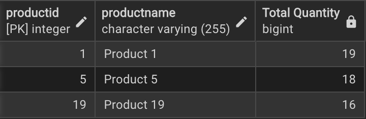
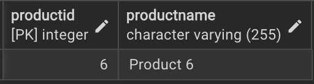
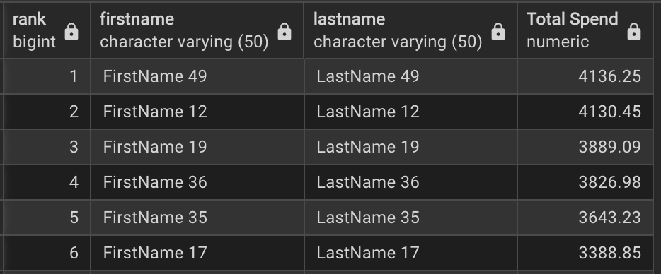
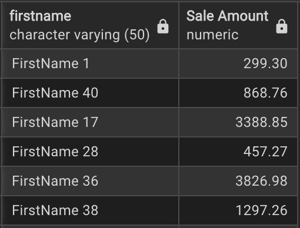

## 🛋️ Alibert Furniture Database — SQL Analysis
This project demonstrates how to extract valuable business insights from the Alibert Furniture Database, which contains information about customers, products, and sales transactions.

## 🗃️ **Database Tables**

| Table         | Description                                      |
|---------------|--------------------------------------------------|
| `customer`    | Customer details such as ID, name, city and signup date |
| `product`| Product information including name, category, and price |
| `sales`| Sale transactions capturing date, quantity sold, sale amount, and respective customer information |

---
## 🎯 **Key Business Questions**
Below are the questions answered in this project using **PostgreSQL queries**

### 🏆 1. Top 3 Best-Selling Products by Quantity
```sql
  SELECT d.productid, d.productname, SUM(f.quantitysold) AS "Total Quantity"
	FROM dimproduct d
	JOIN factsales f ON d.productid = f.productid
	GROUP BY 1,2 
	ORDER BY 3 DESC
	LIMIT 3;
```
<p align="center">
  
</p>

### 📈 2. Products whose sales amount is above average
```sql
  SELECT d.productname, ROUND(AVG(f.saleamount),2) AS "Average Sales"
	FROM dimproduct d
	JOIN factsales f ON d.productid = f.productid
	GROUP BY 1
	HAVING AVG(f.saleamount) > (SELECT ROUND(AVG(saleamount),2) FROM factsales);
```
<p align="center">
  
</p>

### ❌ 3. Products that have never been sold
```sql
  SELECT p.productid, p.productname
	FROM dimproduct p
	WHERE 
	  p.productid NOT IN (
	    SELECT DISTINCT productid FROM factsales
	  );
```
<p align="center">
  
</p>

### 💰 4. Customer total spend and rank
```sql
  SELECT 
	RANK() OVER(ORDER BY COALESCE(SUM(f.saleamount),0)DESC) AS Rank,
		   c.firstname, c.lastname,
		   COALESCE(SUM(f.saleamount),0) AS "Total Spend"
	FROM dimcustomer c
	JOIN factsales f
	ON c.customerid = f.customerid
	GROUP BY  c.firstname, c.lastname
	ORDER BY Rank;
```
<p align="center">
  
</p>

### 🛍️ 5. Customers with the highest purchase(single amount)
```sql
  SELECT c.firstname, SUM(f.saleamount) AS "Sale Amount"
	FROM dimcustomer c
	JOIN factsales f ON c.customerid = f.customerid
	GROUP BY 1; 
```
<p align="center">
  
</p>
