# 📊 NextGen Corp. Employee Analytics

[](https://www.postgresql.org/)
[](https://www.microsoft.com/en-us/microsoft-365/excel)


---

## 🚀 Project Overview

**NextGen Corp.** is a dynamic technology company specializing in innovative software and hardware solutions. While the company continues to attract top talent and drive growth, recent concerns have emerged around:

- Increasing **employee turnover**
- Variability in **employee performance**
- Salary **differences** across departments

This project provides a **data-driven HR strategy** to uncover insights, improve employee retention, and ensure equitable compensation practices across the organization.

---

## 🎯 Objectives

- 🔍 Identify trends and patterns in employee **retention** and **turnover**
- 📈 Track and evaluate **performance** across departments
- ⚖️ Assess the relationship between **salary and performance** to ensure fairness and satisfaction

---

## 🗂️ Datasets

| Table         | Description |
|---------------|-------------|
| `employee`    | Basic employee details, hire dates, and department affiliation |
| `department`  | Department names and IDs |
| `performance` | Employee monthly performance scores |
| `salary`      | Salary data,including historical salary information for each employee |
| `turnover`    | Exit dates and reasons for leaving |
| `attendance`  | Attendance logs for employees |

---

### 💻 Tools Used
- PostgreSQL or 
- Microsoft Excel visuals

---

## 📊 Sample Visuals
_(Add screenshots or chart previews here if applicable)_

---

## 📌 Key Insights
  ### 1) Employee Retention Analysis 
  a) Who are the top 5 highest serving employees?
  ```sql
   SELECT 
   e.employee_id,
   e.department_id,
   e.first_name,
   e.last_name,
   e.hire_date,
   COALESCE(TO_CHAR(t.turnover_date, 'YYYY-MM-DD'), 'Still employed') AS "Status"
   FROM employee e
   LEFT JOIN turnover t ON e.employee_id = t.employee_id
   LEFT JOIN department d ON t.department_id = d.department_id
   WHERE t.turnover_date IS NULL  
   ORDER BY e.hire_date
   LIMIT 5;
   ```
<p align="center">
  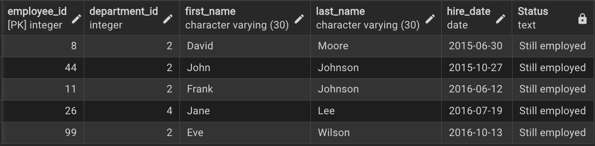
</p>
The image displays the top five longest-serving employees at NextGen Corp., based on their hire dates.

---
 b) What is the turnover rate for each department?
 ####
   This section looks at how many employees are leaving each department. A high turnover rate in a department could mean there are      issues like **poor work environment, low satisfaction, or lack of support**.
   
  I calculated the turnover rate using this formula:
   
            Turnover Rate (%) = (Number of Employees Who Left / Total Employees in Department) * 100

  ```sql
   SELECT 
		d.department_id, 
		d.department_name, 
        ROUND((CAST(COUNT(t.employee_id) AS DECIMAL) / COUNT(e.employee_id) * 100),2) AS "Turnover Rate"
	FROM department d
    JOIN employee e ON d.department_id = e.department_id
	LEFT JOIN turnover t ON e.employee_id = t.employee_id
	GROUP BY d.department_id, d.department_name;
   ```
Results:

  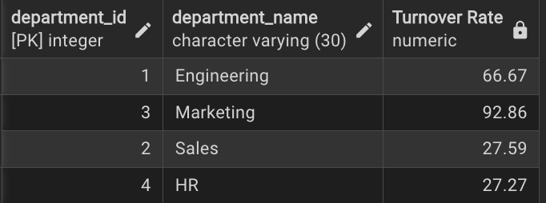 
  
Visualization:  
  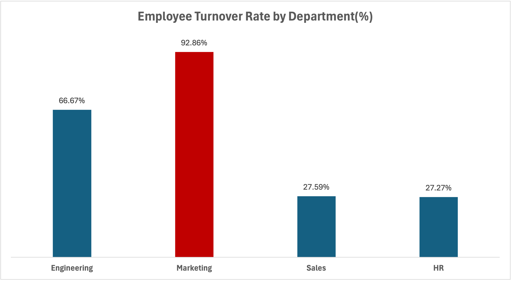

**Key Insights**
- Marketing has the highest turnover rate at 92.86%, suggesting a possible issue with retention in that department.
- Engineering also shows a relatively high turnover rate of 66.67%, which may warrant further investigation.
- Sales and HR have significantly lower turnover rates at 27.59% and 27.27% respectively, indicating better employee stability in those areas.

---
c) Which employees are at risk of leaving based on their performance?
 ####
   Employees with consistently low or declining performance and engagement are more likely to leave. Identifying them early allows    management to offer support and improve retention.
   
  ```sql
   SELECT e.employee_id, 
		   e.first_name,
		   e.last_name,
		   p.performance_score,
		   t.turnover_date
	FROM employee e
   LEFT JOIN performance p ON e.employee_id = p.employee_id
   LEFT JOIN turnover t ON e.employee_id = t.employee_id
   WHERE  p.performance_score <= 3.5 AND turnover_date IS NULL -- they still work at the company
   ORDER BY p.performance_score ASC;
   ```
Results:

  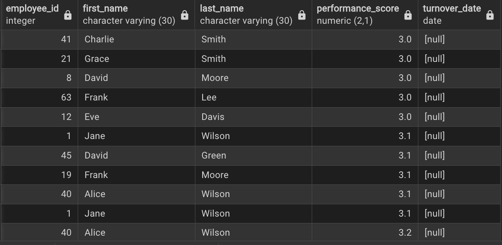 

---
d) What are the main reasons employees are leaving the company?
 ####
   Employees often leave due to factors like lack of growth opportunities, poor management, inadequate compensation, work-life          imbalance, and low job satisfaction. Identifying these causes helps the company address issues and improve retention.
   
  ```sql
   SELECT reason_for_leaving,
	COUNT(employee_id) AS "Total Leave"
	FROM turnover
	GROUP BY reason_for_leaving
	ORDER BY "Total Leave" DESC; 
   ```

Results:

  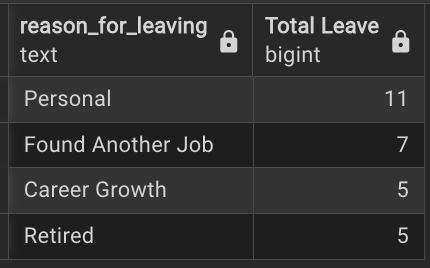 
  
Visualization:  

  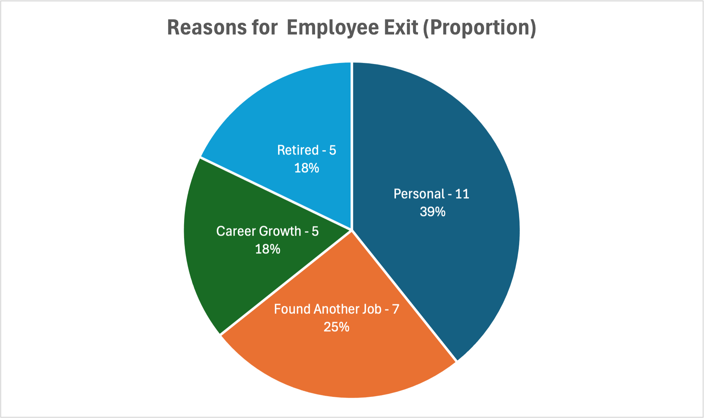 

The top reason employees left the company was due to personal reasons (39%), followed by finding another job (25%). Notably, career growth (18%) was also a key factor, suggesting the company could improve retention by offering clearer advancement opportunities and career development support.

---
 ### 2) Employee Performance Analysis
 a) How many employees have a performance score of 5.0 OR below 3.5
  ```sql
   SELECT 
	CASE 
		WHEN performance_score = 5.0 THEN ' 5.0'
		WHEN performance_score < 3.5 THEN '< 3.5'
	END AS "Score",
	COUNT(*) AS "Total Employees"
FROM performance
WHERE performance_score = 5.0 OR performance_score < 3.5
GROUP BY "Score";
   ```
Results:

 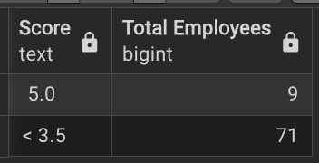
  
Visualization:

  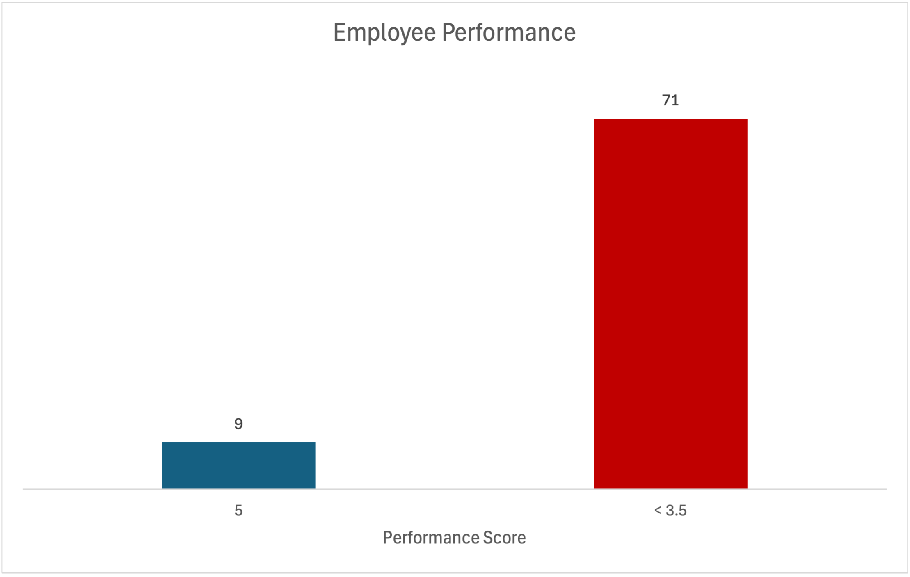
  
 Analysis indicates that 9 employees have a performance score of 5.0 and a total of 71 employees have a score of < 3.5 - this will require closer performance management.

---
 b) Which department has the most employees with a performance of 5.0 / below 3.5?
  ```sql
   SELECT d.department_name, COUNT(*) AS "Total Employees"
FROM performance p
JOIN department d ON p.department_id = d.department_id
WHERE performance_score = 5.0 OR performance_score < 3.5
GROUP BY d.department_name
ORDER BY "Total Employees" DESC
LIMIT 1;
   ```
  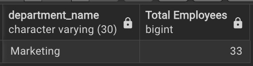

The Marketing department has the highest number of employees at both ends of the performance scale, those rated 5.0 and those below 3.5. This suggests a performance gap within the team that may benefit from closer performance management, clearer expectations, or  support for the underperformers.

---
### 3) Salary Analysis
 a) What is the average salary by job title?
  ```sql
   SELECT e.job_title, 
		   ROUND(AVG(salary_amount),2) AS "Avg Salary"
	FROM employee e
	JOIN salary s ON e.employee_id = s.employee_id
	GROUP BY e.job_title;
   ```
Results:

 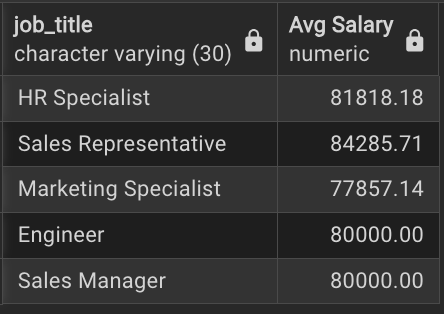
  
Visualization:

  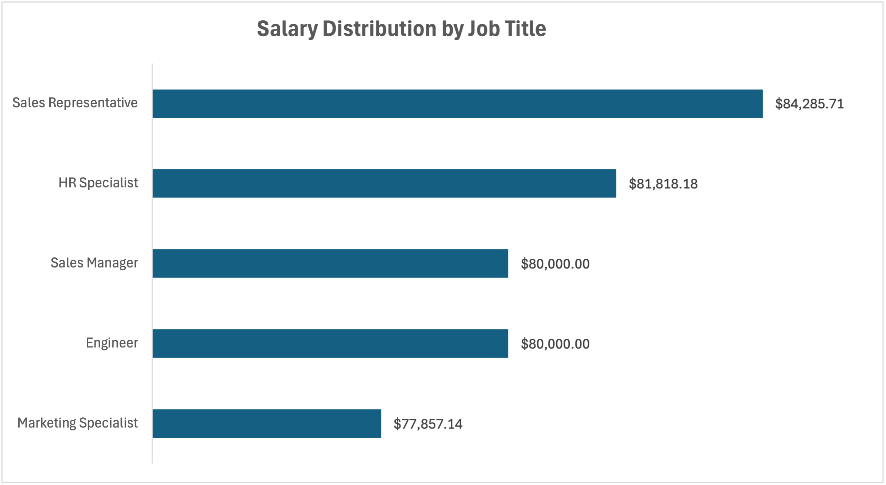
  
 Analysis indicates that 9 employees have a performance score of 5.0 and a total of 71 employees have a score of < 3.5 - this will require closer performance management.

---
 b) Which department has the most employees with a performance of 5.0 / below 3.5?
  ```sql
   SELECT d.department_name, COUNT(*) AS "Total Employees"
FROM performance p
JOIN department d ON p.department_id = d.department_id
WHERE performance_score = 5.0 OR performance_score < 3.5
GROUP BY d.department_name
ORDER BY "Total Employees" DESC
LIMIT 1;
   ```
  

The Marketing department has the highest number of employees at both ends of the performance scale, those rated 5.0 and those below 3.5. This suggests a performance gap within the team that may benefit from closer performance management, clearer expectations, or  support for the underperformers.

---
