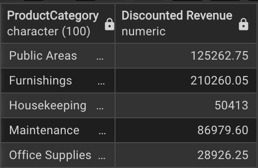
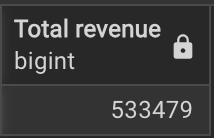
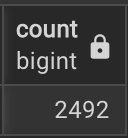
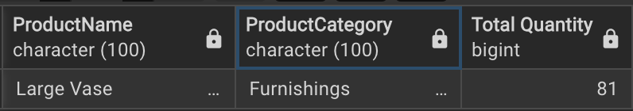
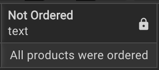

# 🗂️ Lewis Office Stationery & Decors — Business Performance Analysis
[](https://www.postgresql.org/)

This project analyzes sales and product performance for **Lewis Office Stationery & Decors**, a supplier of office supplies, furnishings, housekeeping equipment, and public area items to various properties in the USA.

The data is stored in a **PostgreSQL database** with three main tables:
- **orders** — contains order transactions
- **products** — contains product details, including prices and categories
- **propertyinfo** — contains property details, including city and state

---

## 🏢 **Business Context**

Lewis wants to better understand how the business has performed over time and has provided raw data in SQL format. The goal is to answer key questions to inform revenue optimization, product performance, and future business decisions.

---

## 🗃️ **Database Structure**

| Table         | Description                                                   |
|---------------|----------------------------------------------------------------|
| `orders`      | Records each order placed, including order IDs, product IDs, property IDs, order date and quantities. |
| `products`    | Contains product information such as name, category, and price. |
| `propertyinfo`| Holds details about the properties ordering products, including city and state. |

---

## 📊 **Questions Answered**

### 1. Revenue by Product Category (with Conditional Discounts)

> **Business Rule:**  
> - Products costing **> $100** get a **10% discount**.  
> - Products costing **$50 – $100** get a **5% discount**.  

```sql
SELECT "ProductCategory", 
  	 	SUM(CASE
           WHEN "Price" > 100 then "Price" * 0.9 * "Quantity" 
  				 WHEN "Price" BETWEEN 50 AND 100 then "Price" * 0.95 * "Quantity" 
  				 ELSE "Price" * "Quantity"
  		END) AS "Discounted Revenue" 
FROM orders
JOIN products on orders."ProductID" = products."ProductID" --JOIN: INNER
GROUP BY "ProductCategory";
```

This query indicates the total revenue (with discounts applied) generated from each product category sold by Lewis Office

---
### 2. What is the total revenue generated, considering that products with a NULL(empty) price should be treated as having a default price of $10?  
```sql
SELECT "ProductCategory", 
  	 	SUM(CASE
           WHEN "Price" > 100 then "Price" * 0.9 * "Quantity" 
  				 WHEN "Price" BETWEEN 50 AND 100 then "Price" * 0.95 * "Quantity" 
  				 ELSE "Price" * "Quantity"
  		END) AS "Discounted Revenue" 
FROM orders
JOIN products on orders."ProductID" = products."ProductID" --JOIN: INNER
GROUP BY "ProductCategory";
```

This indicates that Lewis Office made a total revenue of $533,479

---
### 3. How many orders were placed in the year 2015  
```sql
SELECT COUNT(DISTINCT "OrderID") --DISTINCT does not need a bracket on its own
	FROM orders
	WHERE CAST("OrderDate" AS DATE) BETWEEN '2015-01-01' AND '2015-12-31' ;
```

In the year 2015(January to December), 2492 orderes were placed by customers with Lewis Office Stationary & Decors

---
### 4. What's the name and category of the top-selling product(in terms of quantity) in the year 2015?  
```sql
SELECT p."ProductName", p."ProductCategory", sum(o."Quantity") AS "Total Quantity"
	FROM products p
	JOIN orders o ON p."ProductID" = o."ProductID"
	WHERE CAST("OrderDate" AS DATE) BETWEEN '2015-01-01' AND '2015-12-31'
	GROUP BY p."ProductCategory", p."ProductName"
	 ORDER BY "Total Quantity" DESC
	 LIMIT 1;
```

In 2015, Lewis Office sold 81 units of the Large Vase from the Furnishings category

---
### 5. What is the average price of products that have never been ordered? 
```sql
SELECT COALESCE(CAST(AVG("Price") AS TEXT), 'All products were ordered') AS "Not Ordered"
		FROM products
		WHERE "ProductID" NOT IN
			(select distinct "ProductID" from orders);
```

This indicates that all the products available at Lewis Office were sold

