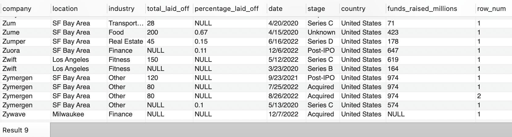
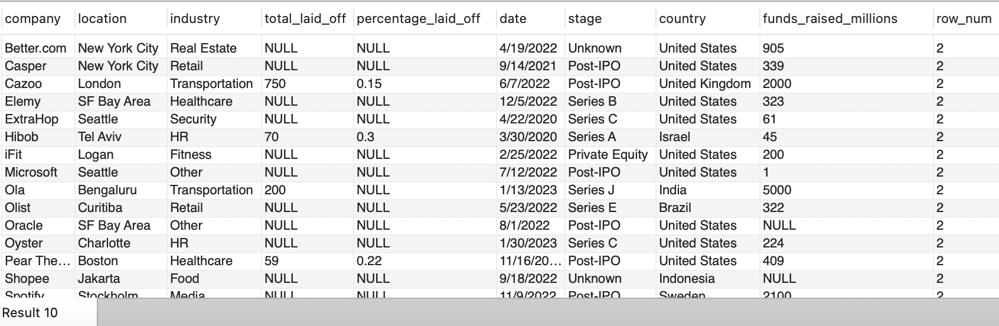
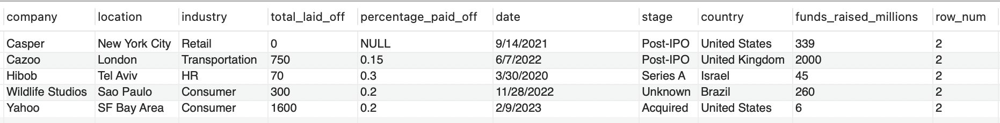
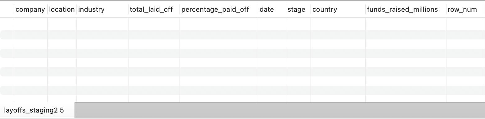
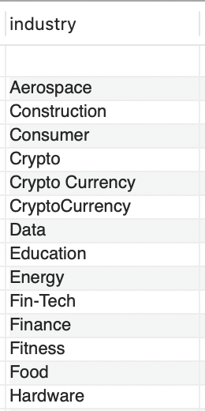
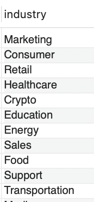

# 🧹 MySQL Data Cleaning Project — layoffs

This project demonstrates **practical data cleaning** using **MySQL**.  
It showcases techniques to check, clean, and transform raw data into a usable format for analysis.

---

## 📊 **Project Overview**

**Context:**  
This dataset records company layoffs, showing how many people were laid off, what percentage of each company’s workforce was affected, when the layoffs occurred, and where they happened. The project aims to clean this data to make it usable for analysis. The dataset was shared by Alex The Analyst on Youtube  
It contained common issues such as:
- Duplicates
- Inconsistent formatting
- NULL or blank values
- Outliers and invalid records

**Goal:**  
To apply **SQL data cleaning techniques** so the final dataset is reliable for analysis and reporting.

---

## 🗃️ **Database Structure**

| Table         | Description                                      |
|---------------|--------------------------------------------------|
| `layoffs.csv`    | Original uncleaned data                          |
| `layoffs_clean.csv`| Final cleaned version, after transformations     |

---
## 👷🏼‍♀️ **Let's Get To Work!**
   **Action:** To prevent accidental changes to the original dataset, I duplicated the data into a new table (layoffs_staging) before starting the cleaning process

```sql
CREATE TABLE layoffs_staging
LIKE layoffs;
```


```sql
INSERT layoffs_staging
SELECT *
FROM layoffs;
```


---
## 🧹 **Key Cleaning Steps**

Below are some tasks I performed with **MySQL queries**.

### ✅ 1. Remove Duplicates
**Action:** I used row numbers to identify duplicates, so any row with a number greater than 1 is a duplicate
```sql
SELECT *,
ROW_NUMBER() OVER(
			PARTITION BY company,location,industry,total_laid_off,percentage_laid_off,'date',stage,country,funds_raised_millions) as row_num
FROM world_layoffs.layoffs_staging;
```


**Action:** Then, I used a common table expression to find all the rows with a number greater than 1 (duplicates)
```sql
WITH duplicate_cte AS
(
	SELECT *,
	ROW_NUMBER() OVER(
				PARTITION BY company,location,industry,total_laid_off,percentage_laid_off,'date',stage,country,funds_raised_millions) as row_num
	FROM world_layoffs.layoffs_staging
)
SELECT *
FROM duplicate_cte
WHERE row_num > 1;
```

I tried to remove the duplicate values

```sql
DELETE
FROM duplicate_cte
WHERE row_num > 1;
```

Guess what! This did not work so I created a new table(layoffs_staging2), inserted values from layoffs_staging, and found duplicates again
```sql
SELECT *
FROM layoffs_staging2
WHERE row_num > 1;
```


I tried again to remove the duplicate values

```sql
DELETE
FROM layoffs_staging2
WHERE row_num > 1;
```
Checking to see if it worked
```sql
SELECT *
FROM layoffs_staging2
WHERE row_num > 1;
```

They're gone!! What a relief! 🥳😅



---

### ✅ 2. Standardize the Data
- This is the process of converting data to a common format to enable users to process and analyze it
  
**Action:** To do this, I had to go through the individual columns most of the time to see if something needs to be fixed
```sql
SELECT DISTINCT industry
FROM layoffs_staging2
ORDER BY 1;
```

We can see that idustry names "crypto", "crypto Currency" seem to be referring to the same thing. So I changed them to "Crypto"

```sql
SELECT *
FROM layoffs_staging2
WHERE industry LIKE 'Crypto%';
```
```sql
UPDATE layoffs_staging2
SET industry = 'Crypto'
WHERE industry LIKE 'Crypto%';
```

