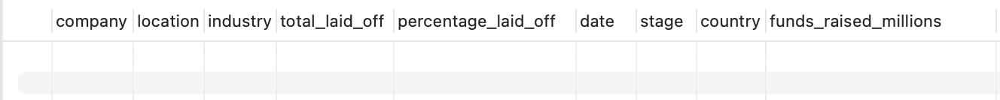
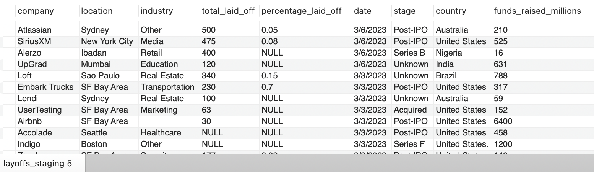

# 🧹 MySQL Data Cleaning Project — layoffs

This project demonstrates **practical data cleaning** using **MySQL**.  
It showcases techniques to check, clean, and transform raw data into a usable format for analysis.

---

## 📊 **Project Overview**

**Context:**  
This dataset records company layoffs, showing how many people were laid off, what percentage of each company’s workforce was affected, when the layoffs occurred, and where they happened. The project aims to clean this data to make it usable for analysis. The dataset was shared by Alex The Analyst on Youtube  
It contained common issues such as:
- Duplicates
- Inconsistent formatting
- NULL or blank values
- Outliers and invalid records

**Goal:**  
To apply **SQL data cleaning techniques** so the final dataset is reliable for analysis and reporting.

---

## 🗃️ **Database Structure**

| Table         | Description                                      |
|---------------|--------------------------------------------------|
| `layoffs.csv`    | Original uncleaned data                          |
| `layoffs_clean.csv`| Final cleaned version, after transformations     |

---
## 👷🏼‍♀️ **Let's Get To Work!**
   To prevent accidental changes to the original dataset, I duplicated the data into a new table (layoffs_staging) before starting the cleaning process

```sql
CREATE TABLE layoffs_staging
LIKE layoffs;
```


```sql
INSERT layoffs_staging
SELECT *
FROM layoffs;
```


---
## 🧹 **Key Cleaning Steps**

Below are some tasks I performed with **MySQL queries**.

### ✅ 1. Remove Duplicates
I used row numbers to identify duplicates, so any row with a number greater than 1 is a duplicate
