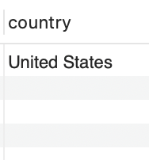
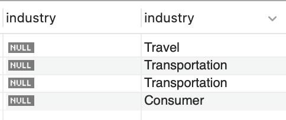

# 🧹 MySQL Data Cleaning Project — layoffs

This project demonstrates **practical data cleaning** using **MySQL**.  
It showcases techniques to check, clean, and transform raw data into a usable format for analysis.

---

## 📊 **Project Overview**

**Context:**  
This dataset records company layoffs, showing how many people were laid off, what percentage of each company’s workforce was affected, when the layoffs occurred, and where they happened. The project aims to clean this data to make it usable for analysis. The dataset was shared by Alex The Analyst on Youtube  
It contained common issues such as:
- Duplicates
- Inconsistent formatting
- NULL or blank values
- Outliers and invalid records

**Goal:**  
To apply **SQL data cleaning techniques** so the final dataset is reliable for analysis and reporting.

---

## 🗃️ **Database Structure**

| Table         | Description                                      |
|---------------|--------------------------------------------------|
| `layoffs.csv`    | Original uncleaned data                          |
| `layoffs_clean.csv`| Final cleaned version, after transformations     |

---
## 👷🏼‍♀️ **Let's Get To Work!**
   **Action:** To prevent accidental changes to the original dataset, I duplicated the data into a new table (layoffs_staging) before starting the cleaning process

```sql
CREATE TABLE layoffs_staging
LIKE layoffs;
```


```sql
INSERT layoffs_staging
SELECT *
FROM layoffs;
```


---
## 🧹 **Key Cleaning Steps**

Below are some tasks I performed with **MySQL queries**.

### ✅ 1. Remove Duplicates
**Action:** I used row numbers to identify duplicates, so any row with a number greater than 1 is a duplicate
```sql
SELECT *,
ROW_NUMBER() OVER(
			PARTITION BY company,location,industry,total_laid_off,percentage_laid_off,'date',stage,country,funds_raised_millions) as row_num
FROM world_layoffs.layoffs_staging;
```


**Action:** Then, I used a common table expression to find all the rows with a number greater than 1 (duplicates)
```sql
WITH duplicate_cte AS
(
	SELECT *,
	ROW_NUMBER() OVER(
				PARTITION BY company,location,industry,total_laid_off,percentage_laid_off,'date',stage,country,funds_raised_millions) as row_num
	FROM world_layoffs.layoffs_staging
)
SELECT *
FROM duplicate_cte
WHERE row_num > 1;
```

I tried to remove the duplicate values

```sql
DELETE
FROM duplicate_cte
WHERE row_num > 1;
```

Guess what! This did not work so I created a new table(layoffs_staging2), inserted values from layoffs_staging, and found duplicates again
```sql
SELECT *
FROM layoffs_staging2
WHERE row_num > 1;
```


I tried again to remove the duplicate values

```sql
DELETE
FROM layoffs_staging2
WHERE row_num > 1;
```
Checking to see if it worked
```sql
SELECT *
FROM layoffs_staging2
WHERE row_num > 1;
```

They're gone!! What a relief! 🥳😅


---

### ✅ 2. Standardize the Data
- This is the process of converting data to a common format to enable users to process and analyze it
  
**Action:** To do this, I had to go through the individual columns most of the time to see if something needs to be fixed
```sql
SELECT DISTINCT industry
FROM layoffs_staging2
ORDER BY 1;
```

We can see that industry names "crypto", "crypto Currency" seem to refer to the same thing. So I changed them to "Crypto"

```sql
SELECT *
FROM layoffs_staging2
WHERE industry LIKE 'Crypto%';
```
```sql
UPDATE layoffs_staging2
SET industry = 'Crypto'
WHERE industry LIKE 'Crypto%';
```


I did this for an entry in the "country" column
```sql
SELECT DISTINCT country
FROM layoffs_staging2
WHERE country LIKE 'United States%' ;
```
```sql
UPDATE layoffs_staging2
SET country = 'United States'
WHERE country LIKE 'United States%';
```
  ~   

#### 2b. Formatting the dataset
While uploading the dataset as a CSV to MySQL, some rows didn’t import correctly. To fix this, I converted the file to JSON instead. However, this caused most of the columns to be read in as TEXT data types. To make the dataset functional and ensure MySQL recognizes each column correctly, I converted the date column from TEXT to the proper DATE format.
```sql
UPDATE layoffs_staging2
SET `date` = str_to_date (`date`, '%m/%d/%Y');
```
  ~   

#### 2c. Renaming Columns
Clear column names make the dataset more user-friendly and self-explanatory. "percentage_paid_off" sounds like it does not belong in the dataset for layoffs


```sql
 ALTER TABLE layoffs_staging2 
 RENAME COLUMN percentage_paid_off TO percentage_laid_off;
```  


#### 2d. Working With Null and Blank Values
While checking the columns, I noticed that some rows in "industry" were blank so I summoned the empty one 😹

```sql
 SELECT industry
FROM layoffs_staging2
WHERE industry IS NULL
OR industry = ' ' OR industry = 'NULL';
```  


I replaced the empty row with SQL's version of blank - NULL
```sql
      UPDATE layoffs_staging2
	SET industry = NULL
	WHERE industry = '' OR industry = 'NULL';
```
Then JOIN'ed the table with itself to check which industry name is NULL using "company" as a common column. This way I can copy the values from the non blank rows to the blank rows
```sql
   SELECT t1.industry, t2.industry
FROM layoffs_staging2 t1
JOIN layoffs_staging2 t2
	 ON t1.company = t2.company
	 WHERE (t1.industry IS NULL) AND t2.industry IS NOT NULL;
```

```sql
  UPDATE layoffs_staging2 t1
JOIN layoffs_staging2 t2
	 ON t1.company = t2.company
	 SET t1.industry = t2.industry
	 WHERE (t1.industry IS NULL) AND t2.industry IS NOT NULL;
```
    
